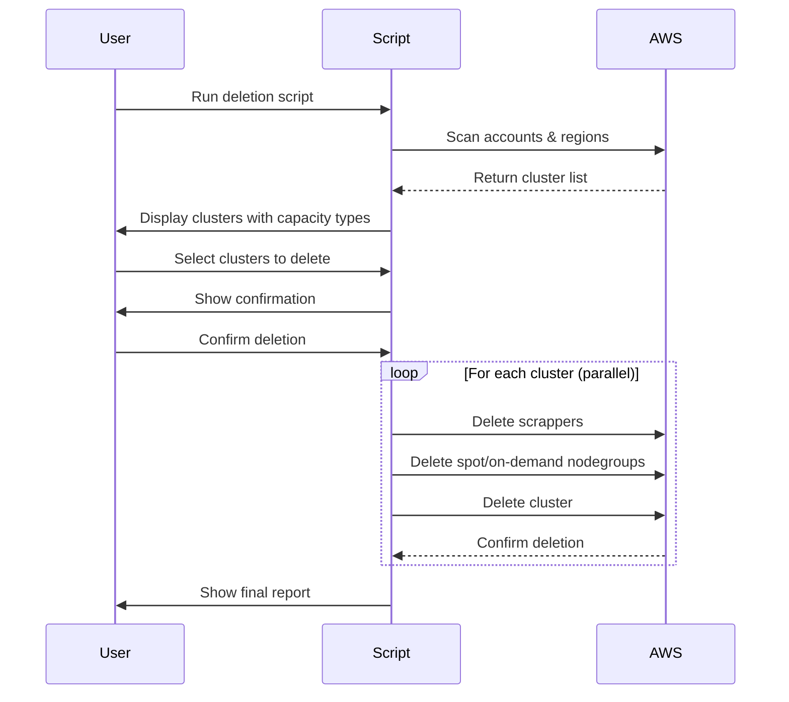
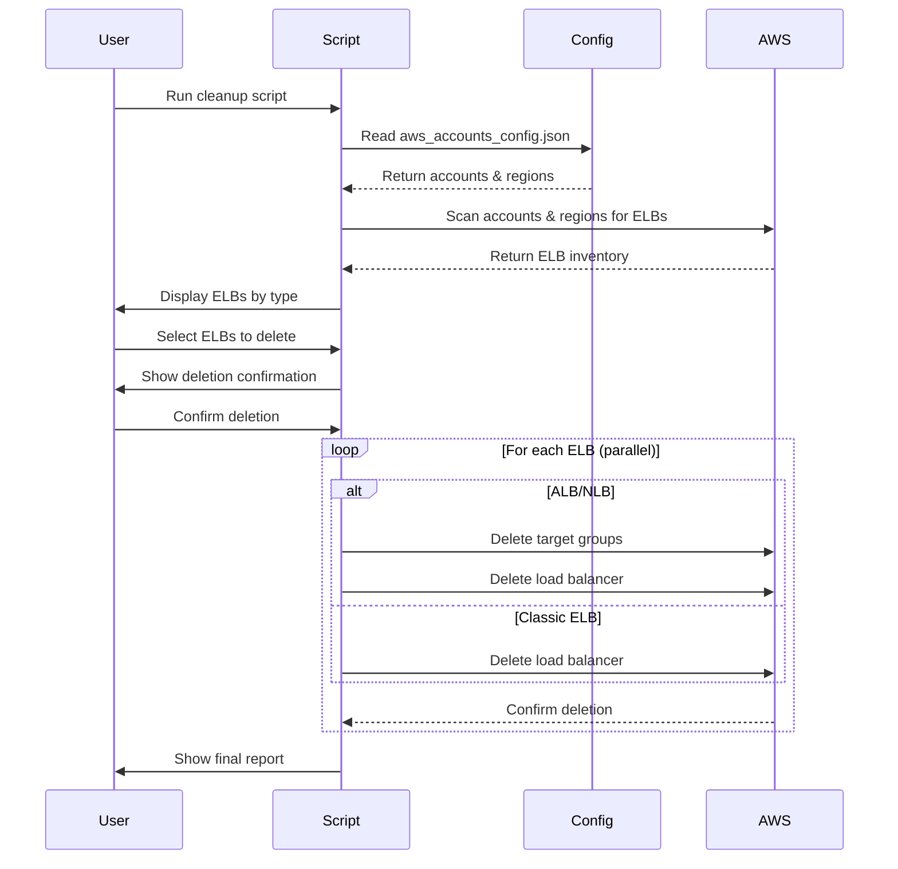

<div align="center">

# 🚀 AWS Infrastructure One-Click Automation Suite


<p align="center">
  
  
  
  
  
  
</p>

### 🎯 **Automate Your AWS Infrastructure with a Single Click!**

*Streamline the creation, management, and cleanup of IAM roles, EKS clusters, EC2 instances, and ELBs across multiple AWS accounts with our powerful automation suite featuring advanced **Spot Instance Intelligence** for cost optimization.*

<p align="center">
  <a href="#-quick-start">Quick Start</a> •
  <a href="#-features">Features</a> •
  <a href="#-spot-instance-intelligence">Spot Intelligence</a> •
  <a href="#-installation">Installation</a> •
  <a href="#-usage-guide">Usage Guide</a> •
  <a href="#-documentation">Documentation</a> •
  <a href="#-contributing">Contributing</a>
</p>

---

### 📈 **Project Statistics**

<table align="center">
<tr>
<td align="center"><strong>🏗️ Infrastructure Types</strong></td>
<td align="center"><strong>⚡ Automation Scripts</strong></td>
<td align="center"><strong>🌍 Multi-Region</strong></td>
<td align="center"><strong>🔧 Languages</strong></td>
</tr>
<tr>
<td align="center">IAM • EKS • EC2 • ELB • Spot</td>
<td align="center">20+ Scripts</td>
<td align="center">5 AWS Regions</td>
<td align="center">Python • Shell</td>
</tr>
</table>

</div>

---

## 💰 Spot Instance Intelligence

<div align="center">

### 🧠 **Smart Cost Optimization with Spot Analysis**

*Leverage AWS Spot Instances for up to 90% cost savings with intelligent pricing analysis and automatic fallback strategies.*

</div>

<table>
<tr>
<td width="25%" align="center">

### 📊 **Price Analysis**
- ✅ **Real-time Spot Pricing**
- ✅ **Historical Price Trends**
- ✅ **Cost Comparison Tools**
- ✅ **Savings Calculator**

</td>
<td width="25%" align="center">

### 🎯 **Smart Selection**
- ✅ **Instance Type Optimization**
- ✅ **Availability Zone Analysis**
- ✅ **Interruption Prediction**
- ✅ **Best Price Discovery**

</td>
<td width="25%" align="center">

### 🛡️ **Risk Management**
- ✅ **Auto-fallback to On-Demand**
- ✅ **Interruption Handling**
- ✅ **Diversification Strategies**
- ✅ **Monitoring & Alerts**

</td>
<td width="25%" align="center">

### 📈 **Intelligence Features**
- ✅ **Capacity Type Selection**
- ✅ **Price Threshold Setting**
- ✅ **Multi-AZ Distribution**
- ✅ **Performance Tracking**

</td>
</tr>
</table>

### 🔍 **How to Use Spot Instance Features**

#### 🚀 **Quick Spot Instance Launch**

```bash
# Launch EC2 Spot Instance with automatic spot analysis
python create_ec2_instances.py --spot-instances

# Launch with specific max price
python create_ec2_instances.py --spot-instances --max-spot-price 0.05

# Create EKS cluster with Spot node groups
python eks_create_cluster_updated.py --capacity-type SPOT

# Create mixed capacity EKS cluster (Spot + On-Demand)
python eks_create_cluster_updated.py --mixed-capacity
```

#### 📊 **Spot Price Analysis**

```bash
# Get current spot prices for instance types
python spot_analysis.py --analyze-pricing --instance-types t3.medium,c5.large

# Historical spot price analysis
python spot_analysis.py --historical --days 30 --region us-east-1

# Compare spot vs on-demand costs
python spot_analysis.py --cost-comparison --instance-type t3.medium
```

#### ⚙️ **Configuration for Spot Instances**

Create or update your `aws_accounts_config.json` with spot-specific settings:

```json
{
  "accounts": {
    "account01": {
      "account_id": "123456789012",
      "email": "user@example.com",
      "access_key": "YOUR_ACCESS_KEY",
      "secret_key": "YOUR_SECRET_KEY"
    }
  },
  "user_settings": {
    "password": "YourSecurePassword@123",
    "allowed_instance_types": ["t2.micro", "t3.micro", "c6a.large", "t3.medium"],
    "users_per_account": 5,
    "user_regions": ["us-east-1", "us-east-2", "us-west-1", "us-west-2", "ap-south-1"]
  },
  "spot_settings": {
    "default_capacity_type": "SPOT",
    "max_spot_price": "0.10",
    "interruption_behavior": "terminate",
    "enable_price_analysis": true,
    "fallback_to_ondemand": true,
    "preferred_az_distribution": true
  }
}
```

#### 🎯 **Spot Instance Value Pickup Guide**

**1. Environment Variables:**
```bash
# Set spot-specific environment variables
export AWS_SPOT_MAX_PRICE="0.05"
export AWS_SPOT_INTERRUPTION_BEHAVIOR="terminate"
export AWS_ENABLE_SPOT_ANALYSIS="true"
```

**2. Configuration File Values:**
```python
# In your Python scripts, pickup values like this:
import json

# Load configuration
with open('aws_accounts_config.json', 'r') as f:
    config = json.load(f)

# Get spot settings
spot_settings = config.get('spot_settings', {})
max_spot_price = spot_settings.get('max_spot_price', '0.10')
capacity_type = spot_settings.get('default_capacity_type', 'SPOT')
enable_analysis = spot_settings.get('enable_price_analysis', True)

print(f"Using spot price: ${max_spot_price}")
print(f"Capacity type: {capacity_type}")
print(f"Price analysis enabled: {enable_analysis}")
```

**3. Runtime Parameters:**
```python
# Access spot instance information from created resources
def get_spot_instance_info(instance_id, ec2_client):
    """Get spot instance details and current pricing"""
    try:
        # Get instance details
        response = ec2_client.describe_instances(InstanceIds=[instance_id])
        instance = response['Reservations'][0]['Instances'][0]
        
        # Check if it's a spot instance
        is_spot = instance.get('SpotInstanceRequestId') is not None
        instance_type = instance['InstanceType']
        capacity_type = 'spot' if is_spot else 'on-demand'
        
        # Get current spot price
        if is_spot:
            spot_prices = ec2_client.describe_spot_price_history(
                InstanceTypes=[instance_type],
                ProductDescriptions=['Linux/UNIX'],
                MaxResults=1
            )
            current_price = spot_prices['SpotPriceHistory'][0]['SpotPrice'] if spot_prices['SpotPriceHistory'] else 'N/A'
        else:
            current_price = 'N/A'
        
        return {
            'instance_id': instance_id,
            'instance_type': instance_type,
            'capacity_type': capacity_type,
            'is_spot': is_spot,
            'current_spot_price': current_price,
            'state': instance['State']['Name']
        }
    except Exception as e:
        print(f"Error getting spot info: {e}")
        return None

# Usage example
instance_info = get_spot_instance_info('i-1234567890abcdef0', ec2_client)
if instance_info:
    print(f"Instance Type: {instance_info['instance_type']}")
    print(f"Capacity Type: {instance_info['capacity_type']}")
    print(f"Current Spot Price: ${instance_info['current_spot_price']}/hour")
```

**4. Monitoring Spot Instances:**
```python
def monitor_spot_instances(account_config):
    """Monitor all spot instances across accounts"""
    for account_name, account_info in account_config['accounts'].items():
        print(f"\n🔍 Monitoring spot instances in {account_name}...")
        
        # Create EC2 client for this account
        ec2_client = boto3.client(
            'ec2',
            aws_access_key_id=account_info['access_key'],
            aws_secret_access_key=account_info['secret_key'],
            region_name='us-east-1'  # or iterate through regions
        )
        
        # Get all spot instances
        response = ec2_client.describe_instances(
            Filters=[
                {'Name': 'instance-lifecycle', 'Values': ['spot']},
                {'Name': 'instance-state-name', 'Values': ['running', 'pending']}
            ]
        )
        
        for reservation in response['Reservations']:
            for instance in reservation['Instances']:
                instance_id = instance['InstanceId']
                instance_type = instance['InstanceType']
                spot_request_id = instance.get('SpotInstanceRequestId', 'N/A')
                
                print(f"  💰 Spot Instance: {instance_id}")
                print(f"     Type: {instance_type}")
                print(f"     Spot Request: {spot_request_id}")
                print(f"     State: {instance['State']['Name']}")
```

---

## 📋 Table of Contents

- [✨ Features](#-features)
- [💰 Spot Instance Intelligence](#-spot-instance-intelligence)
- [🎥 What This Project Does](#-what-this-project-does)
- [🏗️ Architecture Overview](#️-architecture-overview)
- [📦 Prerequisites](#-prerequisites)
- [🔧 Installation](#-installation)
- [🚀 Quick Start](#-quick-start)
- [📖 Detailed Usage Guide](#-detailed-usage-guide)
  - [🔐 IAM Management](#-iam-management)
  - [☸️ EKS Cluster Operations](#️-eks-cluster-operations)
  - [💻 EC2 Instance Management](#-ec2-instance-management)
  - [💰 Spot Instance Operations](#-spot-instance-operations)
  - [⚖️ ELB Cleanup Operations](#️-elb-cleanup-operations)
- [🔐 Security Best Practices](#-security-best-practices)
- [🛠️ Troubleshooting](#️-troubleshooting)
- [🤝 Contributing](#-contributing)
- [📄 License](#-license)
- [👨‍💻 Author](#-author)

---

## 🎥 What This Project Does

<div align="center">

### 🎯 **Complete AWS Infrastructure Automation with Spot Intelligence**

This project provides a comprehensive suite of Python scripts that automate the entire lifecycle of AWS infrastructure components across **multiple AWS accounts** with **parallel processing** capabilities and **advanced spot instance cost optimization**.

</div>

<table>
<tr>
<td width="25%" align="center">

### 🏗️ **CREATE**
- **EKS Clusters** with spot node groups
- **EC2 Spot Instances** with price analysis
- **IAM Roles** with policies
- **Load Balancers** (ALB/NLB/Classic)
- **Cost-optimized infrastructure**

</td>
<td width="25%" align="center">

### 🔄 **MANAGE**
- **Multi-account** operations
- **Parallel processing** for speed
- **Real-time spot pricing**
- **Capacity type selection**
- **Detailed logging**

</td>
<td width="25%" align="center">

### 🗑️ **CLEANUP**
- **Safe deletion** with confirmations
- **Scrapper removal** before EKS deletion
- **Thread-safe** operations
- **Spot instance termination**
- **Comprehensive reporting**

</td>
<td width="25%" align="center">

### 📊 **MONITOR**
- **Spot price tracking**
- **Interruption handling**
- **Performance metrics**
- **Cost analysis**
- **Audit trails**

</td>
</tr>
</table>

---

## ✨ Features

<div align="center">

### 🌟 **Core Capabilities Enhanced with Spot Intelligence**

</div>

<table>
<tr>
<td width="33%" valign="top">

### 🔐 **IAM Management**
- ✅ **Automated Role Creation**
- ✅ **Policy Attachment & Management**
- ✅ **Service-Linked Roles**
- ✅ **Cross-Account Access Setup**
- ✅ **Security Best Practices**
- ✅ **Compliance Validation**

</td>
<td width="33%" valign="top">

### ☸️ **EKS Automation**
- ✅ **Production-Ready Clusters**
- ✅ **Multi-AZ Spot Node Groups**
- ✅ **RBAC Configuration**
- ✅ **Add-ons Management**
- ✅ **Auto-scaling Setup**
- ✅ **Spot/On-Demand Mix**

</td>
<td width="33%" valign="top">

### 💻 **EC2 Operations**
- ✅ **Spot Instance Launch & Config**
- ✅ **Price Analysis & Optimization**
- ✅ **Security Group Setup**
- ✅ **Auto-scaling Groups**
- ✅ **Volume Management**
- ✅ **Cost Monitoring**

</td>
</tr>
</table>

<table>
<tr>
<td width="33%" valign="top">

### 💰 **Spot Intelligence**
- ✅ **Real-time Price Analysis**
- ✅ **Historical Trend Analysis**
- ✅ **Interruption Prediction**
- ✅ **Cost Optimization**
- ✅ **Auto-fallback Strategies**
- ✅ **Multi-AZ Distribution**

</td>
<td width="33%" valign="top">

### 🚀 **Advanced Features**
- ✅ **Multi-Account Support**
- ✅ **Parallel Processing**
- ✅ **Thread-Safe Operations**
- ✅ **Real-time Progress**
- ✅ **Comprehensive Logging**
- ✅ **Error Recovery**

</td>
<td width="33%" valign="top">

### 🛡️ **Safety & Security**
- ✅ **Multiple Confirmations**
- ✅ **Dry-Run Mode**
- ✅ **Audit Logging**
- ✅ **Rollback Capabilities**
- ✅ **Encryption Support**
- ✅ **Access Control**

</td>
</tr>
</table>

---

## 🏗️ Architecture Overview

<div align="center">

### 📐 **System Architecture with Spot Intelligence**

```mermaid
graph TB
    subgraph "🎯 One-Click Automation Suite"
        A[Main Controller] --> B[🔐 IAM Module]
        A --> C[☸️ EKS Module]
        A --> D[💻 EC2 Module]
        A --> E[⚖️ ELB Module]
        A --> F[💰 Spot Intelligence]
    end
    
    subgraph "💰 Spot Intelligence"
        F --> F1[Price Analysis]
        F --> F2[Cost Optimization]
        F --> F3[Interruption Handling]
        F --> F4[Capacity Selection]
    end
    
    subgraph "🔐 IAM Operations"
        B --> B1[Create Roles]
        B --> B2[Attach Policies]
        B --> B3[Generate Keys]
        B --> B4[Security Validation]
    end
    
    subgraph "☸️ EKS Operations"
        C --> C1[Create Clusters]
        C --> C2[Configure Networking]
        C --> C3[Deploy Spot Node Groups]
        C --> C4[Setup Monitoring]
        C --> C5[Delete Scrappers]
    end
    
    subgraph "💻 EC2 Operations"
        D --> D1[Launch Spot Instances]
        D --> D2[Configure Security]
        D --> D3[Setup Auto-scaling]
        D --> D4[Volume Management]
        D --> D5[Price Monitoring]
    end
    
    subgraph "⚖️ ELB Operations"
        E --> E1[Scan Load Balancers]
        E --> E2[Delete ALB/NLB/Classic]
        E --> E3[Target Group Cleanup]
        E --> E4[Parallel Processing]
    end
    
    subgraph "🌍 Multi-Account Support"
        G[Account 1] --> H[Config Management]
        I[Account 2] --> H
        J[Account N] --> H
        H --> K[Region Selection]
        K --> L[Parallel Execution]
    end
    
    A --> G
    A --> I
    A --> J
    F --> D
    F --> C
    
    style A fill:#f9f,stroke:#333,stroke-width:4px
    style B fill:#bbf,stroke:#333,stroke-width:2px
    style C fill:#bfb,stroke:#333,stroke-width:2px
    style D fill:#fbb,stroke:#333,stroke-width:2px
    style E fill:#ffb,stroke:#333,stroke-width:2px
    style F fill:#fdb,stroke:#333,stroke-width:3px
    style H fill:#fbf,stroke:#333,stroke-width:2px
```

</div>



---

## 📦 Prerequisites

<details>
<summary><b>🔍 Click to expand system requirements</b></summary>

### 💻 **System Requirements**
- **Operating System**: Windows 10+, macOS 10.15+, Ubuntu 18.04+
- **Python**: 3.8 or higher
- **Memory**: 4GB RAM minimum, 8GB recommended
- **Storage**: 2GB free space
- **Network**: Stable internet connection

### 🔧 **Required Software**
- **AWS CLI**: Version 2.x
- **kubectl**: Latest stable version
- **eksctl**: 0.150.0 or higher
- **Git**: For cloning the repository

### 📋 **AWS Requirements**
- **Active AWS Account(s)**: One or multiple accounts
- **IAM Permissions**: Administrative access or specific permissions
- **AWS Credentials**: Access keys configured
- **Regions**: Access to target AWS regions
- **Spot Instance Quotas**: Adequate service quotas for spot instances

### 🛠️ **Installation Commands**

```bash
# Install Python dependencies
pip install boto3 awscli pyyaml requests threading

# Install AWS CLI (Linux/macOS)
curl "https://awscli.amazonaws.com/awscli-exe-linux-x86_64.zip" -o "awscliv2.zip"
unzip awscliv2.zip
sudo ./aws/install

# Install AWS CLI (Windows)
# Download and run: https://awscli.amazonaws.com/AWSCLIV2.msi

# Install kubectl (Linux)
curl -LO "https://dl.k8s.io/release/$(curl -L -s https://dl.k8s.io/release/stable.txt)/bin/linux/amd64/kubectl"
sudo install -o root -g root -m 0755 kubectl /usr/local/bin/kubectl

# Install kubectl (macOS)
brew install kubectl

# Install kubectl (Windows)
# Download from: https://dl.k8s.io/release/v1.28.0/bin/windows/amd64/kubectl.exe

# Install eksctl (Linux/macOS)
curl --silent --location "https://github.com/weaveworks/eksctl/releases/latest/download/eksctl_$(uname -s)_amd64.tar.gz" | tar xz -C /tmp
sudo mv /tmp/eksctl /usr/local/bin

# Install eksctl (Windows)
# Download from: https://github.com/weaveworks/eksctl/releases
```

</details>

---

## 🔧 Installation

### 📥 **Step 1: Clone the Repository**

```bash
# Clone the repository
git clone https://github.com/varadharajaan/aws-create-iam-eks-ec2-one-click.git

# Navigate to the project directory
cd aws-create-iam-eks-ec2-one-click

# Switch to the spot enhancement branch
git checkout varad/enchance-spot

# Check project structure
ls -la
```

### 📦 **Step 2: Install Dependencies**

```bash
# Install Python dependencies
pip install -r requirements.txt

# Or install manually
pip install boto3 awscli pyyaml requests colorama threading concurrent.futures
```

### ⚙️ **Step 3: Configure AWS Credentials**

```bash
# Configure AWS CLI (method 1)
aws configure

# Or set environment variables (method 2)
export AWS_ACCESS_KEY_ID="your-access-key"
export AWS_SECRET_ACCESS_KEY="your-secret-key"
export AWS_DEFAULT_REGION="us-east-1"
```

### 📝 **Step 4: Setup Configuration File with Spot Settings**

Create your `aws_accounts_config.json` file with enhanced spot configuration:

```json
{
  "accounts": {
    "account01": {
      "account_id": "123456789012",
      "email": "user@example.com",
      "access_key": "YOUR_ACCESS_KEY",
      "secret_key": "YOUR_SECRET_KEY"
    },
    "account02": {
      "account_id": "123456789013",
      "email": "user2@example.com",
      "access_key": "YOUR_ACCESS_KEY_2",
      "secret_key": "YOUR_SECRET_KEY_2"
    }
  },
  "user_settings": {
    "password": "YourSecurePassword@123",
    "allowed_instance_types": ["t2.micro", "t3.micro", "c6a.large", "t3.medium", "c5.large"],
    "users_per_account": 5,
    "user_regions": ["us-east-1", "us-east-2", "us-west-1", "us-west-2", "ap-south-1"]
  },
  "spot_settings": {
    "default_capacity_type": "SPOT",
    "max_spot_price": "0.10",
    "interruption_behavior": "terminate",
    "enable_price_analysis": true,
    "fallback_to_ondemand": true,
    "preferred_az_distribution": true,
    "spot_allocation_strategy": "diversified",
    "monitoring_enabled": true
  }
}
```

---

## 🚀 Quick Start

<div align="center">

### **🎯 Get Started with Spot Instances in 3 Simple Steps!**

</div>

<table>
<tr>
<td width="33%" align="center">

### **1️⃣ Configure**
```bash
# Setup your config file with spot settings
cp config.example.json aws_accounts_config.json
# Edit with your credentials and spot preferences
```

</td>
<td width="33%" align="center">

### **2️⃣ Choose Operation**
```bash
# Create spot instances
python create_ec2_instances.py --spot

# Create EKS with spot nodes
python eks_create_cluster_updated.py
```

</td>
<td width="33%" align="center">

### **3️⃣ Monitor & Save**
```bash
# Watch your cost savings!
# Real-time spot price tracking
# Up to 90% cost reduction
```

</td>
</tr>
</table>

### 🎬 **Common Use Cases with Spot Intelligence**

```bash
# 🏗️ CREATE OPERATIONS WITH SPOT
python create_iam_roles.py                    # Create IAM roles
python create_ec2_instances.py --spot         # Launch spot EC2 instances
python eks_create_cluster_updated.py          # Create EKS with spot nodes (interactive)

# 💰 SPOT ANALYSIS OPERATIONS
python spot_analysis.py --current-prices      # Get current spot prices
python spot_analysis.py --cost-comparison     # Compare spot vs on-demand costs
python spot_analysis.py --best-prices         # Find best spot prices by AZ

# 🗑️ CLEANUP OPERATIONS  
python eks_delete_cleanup_threaded.py         # Delete EKS clusters (with scrappers)
python elb_cleanup_multi_account.py           # Clean up all ELBs

# 🔧 UTILITY OPERATIONS
python utils/validate.py                      # Validate configurations
python utils/monitor_spot.py                  # Monitor spot instances
python utils/cleanup.py --dry-run             # Preview cleanup operations
```

---

## 📖 Detailed Usage Guide

### 💰 Spot Instance Operations

<details>
<summary><b>📁 Enhanced Spot Instance Management</b> - Intelligent Cost Optimization</summary>

#### 🎯 **Purpose**
Leverage AWS Spot Instances to achieve up to 90% cost savings while maintaining high availability and performance through intelligent pricing analysis and automated management.

#### ✨ **Enhanced Spot Features**
- ✅ **Real-time Price Analysis** - Current spot pricing across all AZs
- ✅ **Historical Trend Analysis** - Price history and pattern recognition
- ✅ **Intelligent Capacity Selection** - SPOT vs ON_DEMAND decision making
- ✅ **Interruption Handling** - Graceful handling of spot interruptions
- ✅ **Auto-fallback Strategy** - Automatic fallback to on-demand when needed
- ✅ **Multi-AZ Distribution** - Spread instances across availability zones
- ✅ **Cost Monitoring** - Continuous cost tracking and reporting

#### 🚀 **Usage Examples**

**Basic Spot Instance Creation:**
```bash
# Launch spot EC2 instance with automatic price analysis
python create_ec2_instances.py --spot-instances

# Launch with specific maximum price
python create_ec2_instances.py --spot-instances --max-spot-price 0.05

# Launch spot instance with enhanced monitoring
python create_ec2_with_aws_configure.py --spot --enable-monitoring
```

**EKS Cluster with Spot Node Groups:**
```bash
# Create EKS cluster with interactive capacity type selection
python eks_create_cluster_updated.py

# During execution, you'll see:
# 💰 Capacity Type Selection
# ====================================
# Available capacity types:
#   1. SPOT (default) - Lower cost, may be interrupted
#   2. ON_DEMAND - Higher cost, stable
# ====================================
# Select capacity type (1-2) [default: SPOT]: 1
# ✅ Selected capacity type: SPOT
```

**Advanced Spot Configuration:**
```bash
# Create mixed capacity cluster (spot + on-demand)
python eks_create_cluster_updated.py --mixed-capacity

# Create with specific spot allocation strategy
python eks_create_cluster_updated.py --spot-allocation-strategy diversified
```

#### 📊 **Spot Price Analysis Tools**

**Get Current Spot Prices:**
```python
import boto3

def get_current_spot_prices(instance_types, region='us-east-1'):
    """Get current spot prices for specified instance types"""
    ec2 = boto3.client('ec2', region_name=region)
    
    spot_prices = ec2.describe_spot_price_history(
        InstanceTypes=instance_types,
        ProductDescriptions=['Linux/UNIX'],
        MaxResults=10
    )
    
    for price in spot_prices['SpotPriceHistory']:
        print(f"Instance: {price['InstanceType']}")
        print(f"AZ: {price['AvailabilityZone']}")
        print(f"Price: ${price['SpotPrice']}/hour")
        print(f"Timestamp: {price['Timestamp']}")
        print("-" * 40)

# Usage
get_current_spot_prices(['t3.micro', 't3.small', 't3.medium'])
```

**Cost Comparison Analysis:**
```python
def compare_spot_ondemand_costs(instance_type, region='us-east-1'):
    """Compare spot vs on-demand pricing"""
    ec2 = boto3.client('ec2', region_name=region)
    
    # Get spot price
    spot_response = ec2.describe_spot_price_history(
        InstanceTypes=[instance_type],
        ProductDescriptions=['Linux/UNIX'],
        MaxResults=1
    )
    
    if spot_response['SpotPriceHistory']:
        spot_price = float(spot_response['SpotPriceHistory'][0]['SpotPrice'])
        
        # Get on-demand price (simplified - in practice, use AWS Price List API)
        # This is a simplified example
        on_demand_prices = {
            't3.micro': 0.0104,
            't3.small': 0.0208,
            't3.medium': 0.0416,
            't3.large': 0.0832
        }
        
        on_demand_price = on_demand_prices.get(instance_type, 0)
        if on_demand_price:
            savings = ((on_demand_price - spot_price) / on_demand_price) * 100
            
            print(f"💰 Cost Analysis for {instance_type}:")
            print(f"   On-Demand: ${on_demand_price:.4f}/hour")
            print(f"   Spot:      ${spot_price:.4f}/hour")
            print(f"   Savings:   {savings:.1f}%")
            print(f"   Monthly Savings: ${(on_demand_price - spot_price) * 24 * 30:.2f}")

# Usage
compare_spot_ondemand_costs('t3.medium')
```

#### 🎯 **Value Pickup and Configuration**

**1. Reading Spot Configuration:**
```python
import json
import os

def load_spot_configuration():
    """Load spot-specific configuration from config file"""
    config_file = 'aws_accounts_config.json'
    
    if os.path.exists(config_file):
        with open(config_file, 'r') as f:
            config = json.load(f)
            
        spot_settings = config.get('spot_settings', {})
        
        return {
            'default_capacity_type': spot_settings.get('default_capacity_type', 'SPOT'),
            'max_spot_price': float(spot_settings.get('max_spot_price', '0.10')),
            'interruption_behavior': spot_settings.get('interruption_behavior', 'terminate'),
            'enable_price_analysis': spot_settings.get('enable_price_analysis', True),
            'fallback_to_ondemand': spot_settings.get('fallback_to_ondemand', True),
            'preferred_az_distribution': spot_settings.get('preferred_az_distribution', True)
        }
    else:
        return None

# Usage
spot_config = load_spot_configuration()
if spot_config:
    print(f"Max Spot Price: ${spot_config['max_spot_price']}")
    print(f"Capacity Type: {spot_config['default_capacity_type']}")
    print(f"Price Analysis: {spot_config['enable_price_analysis']}")
```

**2. Environment Variable Override:**
```python
def get_effective_spot_settings():
    """Get spot settings with environment variable overrides"""
    config = load_spot_configuration() or {}
    
    # Environment variables take precedence
    effective_settings = {
        'max_spot_price': float(os.getenv('AWS_SPOT_MAX_PRICE', config.get('max_spot_price', '0.10'))),
        'capacity_type': os.getenv('AWS_SPOT_CAPACITY_TYPE', config.get('default_capacity_type', 'SPOT')),
        'interruption_behavior': os.getenv('AWS_SPOT_INTERRUPTION_BEHAVIOR', 
                                         config.get('interruption_behavior', 'terminate')),
        'enable_analysis': os.getenv('AWS_ENABLE_SPOT_ANALYSIS', 
                                   str(config.get('enable_price_analysis', True))).lower() == 'true'
    }
    
    return effective_settings

# Usage
settings = get_effective_spot_settings()
print(f"Effective max price: ${settings['max_spot_price']}")
```

**3. Runtime Spot Instance Information:**
```python
def get_comprehensive_spot_info(instance_id, region='us-east-1'):
    """Get comprehensive spot instance information"""
    ec2 = boto3.client('ec2', region_name=region)
    
    try:
        # Get instance details
        response = ec2.describe_instances(InstanceIds=[instance_id])
        instance = response['Reservations'][0]['Instances'][0]
        
        # Extract spot-specific information
        spot_info = {
            'instance_id': instance_id,
            'instance_type': instance['InstanceType'],
            'availability_zone': instance['Placement']['AvailabilityZone'],
            'state': instance['State']['Name'],
            'launch_time': instance['LaunchTime'],
            'is_spot': instance.get('SpotInstanceRequestId') is not None,
            'spot_request_id': instance.get('SpotInstanceRequestId'),
            'lifecycle': instance.get('InstanceLifecycle', 'on-demand')
        }
        
        # Get current spot price for this instance type and AZ
        if spot_info['is_spot']:
            spot_prices = ec2.describe_spot_price_history(
                InstanceTypes=[spot_info['instance_type']],
                AvailabilityZones=[spot_info['availability_zone']],
                ProductDescriptions=['Linux/UNIX'],
                MaxResults=1
            )
            
            if spot_prices['SpotPriceHistory']:
                spot_info['current_spot_price'] = spot_prices['SpotPriceHistory'][0]['SpotPrice']
                spot_info['price_timestamp'] = spot_prices['SpotPriceHistory'][0]['Timestamp']
            
            # Get spot instance request details
            if spot_info['spot_request_id']:
                spot_requests = ec2.describe_spot_instance_requests(
                    SpotInstanceRequestIds=[spot_info['spot_request_id']]
                )
                
                if spot_requests['SpotInstanceRequests']:
                    request = spot_requests['SpotInstanceRequests'][0]
                    spot_info['spot_price_requested'] = request.get('SpotPrice')
                    spot_info['spot_type'] = request.get('Type')
                    spot_info['spot_state'] = request.get('State')
        
        return spot_info
        
    except Exception as e:
        print(f"Error retrieving spot info: {e}")
        return None

# Usage
info = get_comprehensive_spot_info('i-1234567890abcdef0')
if info and info['is_spot']:
    print(f"🔥 Spot Instance Details:")
    print(f"   Instance ID: {info['instance_id']}")
    print(f"   Type: {info['instance_type']}")
    print(f"   AZ: {info['availability_zone']}")
    print(f"   Current Price: ${info.get('current_spot_price', 'N/A')}/hour")
    print(f"   Requested Price: ${info.get('spot_price_requested', 'N/A')}/hour")
    print(f"   State: {info['state']}")
```

#### 📈 **Monitoring and Automation**

**Spot Instance Health Check:**
```python
def monitor_spot_fleet_health(account_config):
    """Monitor the health of all spot instances across accounts"""
    total_instances = 0
    running_instances = 0
    interrupted_instances = 0
    
    for account_name, account_info in account_config['accounts'].items():
        print(f"\n🔍 Checking spot instances in {account_name}...")
        
        for region in account_config['user_settings']['user_regions']:
            ec2 = boto3.client(
                'ec2',
                region_name=region,
                aws_access_key_id=account_info['access_key'],
                aws_secret_access_key=account_info['secret_key']
            )
            
            # Get all spot instances
            response = ec2.describe_instances(
                Filters=[
                    {'Name': 'instance-lifecycle', 'Values': ['spot']},
                    {'Name': 'instance-state-name', 'Values': ['running', 'pending', 'stopping', 'stopped']}
                ]
            )
            
            for reservation in response['Reservations']:
                for instance in reservation['Instances']:
                    total_instances += 1
                    state = instance['State']['Name']
                    
                    if state == 'running':
                        running_instances += 1
                    elif state in ['stopping', 'stopped']:
                        interrupted_instances += 1
                    
                    instance_id = instance['InstanceId']
                    instance_type = instance['InstanceType']
                    az = instance['Placement']['AvailabilityZone']
                    
                    print(f"   💰 {instance_id} ({instance_type}) in {az}: {state}")
    
    print(f"\n📊 Spot Fleet Summary:")
    print(f"   Total Spot Instances: {total_instances}")
    print(f"   Running: {running_instances}")
    print(f"   Interrupted: {interrupted_instances}")
    
    if total_instances > 0:
        uptime_percentage = (running_instances / total_instances) * 100
        print(f"   Uptime: {uptime_percentage:.1f}%")

# Usage
with open('aws_accounts_config.json', 'r') as f:
    config = json.load(f)
monitor_spot_fleet_health(config)
```

</details>

### 🔐 IAM Management

<details>
<summary><b>📁 create_iam_roles.py</b> - Comprehensive IAM Role Automation</summary>

#### 🎯 **Purpose**
Automates the creation and configuration of IAM roles required for EKS clusters, EC2 instances, and cross-account access with security best practices.

#### ✨ **Features**
- ✅ **EKS Service Roles** - Complete cluster role setup
- ✅ **Node Instance Profiles** - Worker node permissions
- ✅ **Trust Relationships** - Secure service-to-service access
- ✅ **Policy Management** - Automatic policy attachment
- ✅ **Security Validation** - Compliance checking
- ✅ **Cross-Account Support** - Multi-account role creation

#### 🚀 **Usage Examples**

```bash
# Basic IAM role creation
python create_iam_roles.py

# With custom configuration
python create_iam_roles.py --config config/iam_config.yaml

# Dry run mode (preview changes without executing)
python create_iam_roles.py --dry-run

# Verbose logging
python create_iam_roles.py --verbose

# Create roles for specific accounts
python create_iam_roles.py --accounts account01,account02
```

#### 📋 **Configuration Example**

```yaml
# config/iam_config.yaml
roles:
  eks_cluster_role:
    name: "EKSClusterServiceRole"
    description: "Role for EKS cluster operations"
    trust_policy: "eks.amazonaws.com"
    policies:
      - "arn:aws:iam::aws:policy/AmazonEKSClusterPolicy"
      - "arn:aws:iam::aws:policy/AmazonEKSVPCResourceController"
    tags:
      Environment: "Production"
      ManagedBy: "AutomationSuite"
  
  node_instance_role:
    name: "EKSNodeInstanceRole"
    description: "Role for EKS worker nodes"
    trust_policy: "ec2.amazonaws.com"
    policies:
      - "arn:aws:iam::aws:policy/AmazonEKSWorkerNodePolicy"
      - "arn:aws:iam::aws:policy/AmazonEKS_CNI_Policy"
      - "arn:aws:iam::aws:policy/AmazonEC2ContainerRegistryReadOnly"
    instance_profile: true
    tags:
      Environment: "Production"
      NodeType: "Worker"

security_settings:
  enforce_mfa: true
  session_duration: 3600
  external_id_required: false
```

#### 📊 **Output & Reporting**
- **Real-time Progress**: Live updates during role creation
- **Detailed Logs**: Complete audit trail in `iam_creation_log_YYYYMMDD_HHMMSS.log`
- **Summary Report**: Final report with created roles and any errors
- **JSON Export**: Machine-readable output for automation pipelines

</details>

### ☸️ EKS Cluster Operations

<details>
<summary><b>📁 eks_create_cluster_updated.py</b> - Production-Ready Kubernetes with Spot Intelligence</summary>

#### 🎯 **Purpose**
Provisions production-ready EKS clusters with best practices for security, scalability, and high availability across multiple AWS regions, featuring advanced spot instance integration for cost optimization.

#### ✨ **Features**
- ✅ **Multi-AZ Deployment** - High availability setup
- ✅ **Private Endpoint Access** - Enhanced security
- ✅ **Spot/On-Demand Node Groups** - Intelligent capacity selection
- ✅ **Add-ons Management** - CNI, CoreDNS, kube-proxy
- ✅ **RBAC Configuration** - Role-based access control
- ✅ **Monitoring Integration** - CloudWatch and Prometheus ready
- ✅ **Interactive Capacity Selection** - User-friendly spot/on-demand choice

#### 🚀 **Usage Examples**

```bash
# Create EKS cluster with interactive capacity selection
python eks_create_cluster_updated.py

# The script will prompt you:
# 💰 Capacity Type Selection
# ====================================
# Available capacity types:
#   1. SPOT (default) - Lower cost, may be interrupted
#   2. ON_DEMAND - Higher cost, stable
# ====================================
# Select capacity type (1-2) [default: SPOT]: 

# Create cluster with specific capacity type
python eks_create_cluster_updated.py --capacity-type SPOT

# Create mixed capacity cluster
python eks_create_cluster_updated.py --mixed-capacity

# Create with multiple node groups
python eks_create_cluster_updated.py --multi-nodegroup
```

#### 🔄 **Post-Deployment Operations**

```bash
# Update kubeconfig
aws eks update-kubeconfig --region us-west-2 --name production-k8s-cluster

# Verify cluster access
kubectl get nodes
kubectl get pods --all-namespaces

# Check node capacity types
kubectl get nodes -o custom-columns=NAME:.metadata.name,CAPACITY-TYPE:.metadata.labels.eks\.amazonaws\.com/capacityType

# Deploy sample application
kubectl apply -f examples/sample-app.yaml

# Install additional tools
kubectl apply -f https://raw.githubusercontent.com/kubernetes/dashboard/v2.7.0/aio/deploy/recommended.yaml

# Setup monitoring
helm repo add prometheus-community https://prometheus-community.github.io/helm-charts
helm install prometheus prometheus-community/kube-prometheus-stack
```

#### 💰 **Spot Node Group Benefits**
- **Cost Savings**: Up to 90% reduction in compute costs
- **Diversification**: Automatic distribution across multiple instance types and AZs
- **Graceful Handling**: Built-in spot interruption management
- **Auto-scaling**: Dynamic scaling based on workload demands
- **Monitoring**: Real-time cost and performance tracking

</details>

<details>
<summary><b>📁 eks_delete_cleanup_threaded.py</b> - Safe EKS Cluster Deletion with Scrapper Cleanup</summary>

#### 🎯 **Purpose**
Safely deletes EKS clusters with comprehensive cleanup of associated resources including scrappers, monitoring tools, and dependencies using parallel processing.

#### ✨ **Features**
- ✅ **Scrapper Cleanup** - Removes monitoring tools before cluster deletion
- ✅ **Parallel Processing** - Up to 3 simultaneous cluster deletions
- ✅ **Safety Confirmations** - Multiple confirmation steps
- ✅ **Thread-Safe Operations** - Concurrent execution without conflicts
- ✅ **Comprehensive Logging** - Detailed audit trails
- ✅ **Error Recovery** - Handles partial failures gracefully
- ✅ **Spot Instance Cleanup** - Proper termination of spot instances

#### 🔧 **Scrapper Types Detected & Removed**
- **CloudWatch Alarms** - Custom metrics and alarms
- **AMP Workspaces** - Amazon Managed Prometheus
- **EKS Add-ons** - Monitoring add-ons (fluent-bit, ADOT, CloudWatch)
- **EC2 Instances** - Tagged scrapper instances (including spot instances)
- **Kubernetes Deployments** - Prometheus, Grafana, Jaeger, etc.

#### 🚀 **Usage Examples**

```bash
# Interactive cluster deletion with scrapper cleanup
python eks_delete_cleanup_threaded.py

# The script will:
# 1. Scan all accounts and regions
# 2. Display found clusters (including spot node groups)
# 3. Allow selection of clusters to delete
# 4. Show confirmation with details
# 5. Delete scrappers first, then nodegroups, then clusters
```

#### 📊 **Deletion Process Flow**



</details>

### 💻 EC2 Instance Management

<details>
<summary><b>📁 create_ec2_instances.py & create_ec2_with_aws_configure.py</b> - Enhanced EC2 Automation with Spot Intelligence</summary>

#### 🎯 **Purpose**
Automates EC2 instance provisioning with security best practices, monitoring setup, and comprehensive spot instance support for maximum cost optimization.

#### ✨ **Enhanced Features**
- ✅ **Intelligent Spot Instance Creation** - Automatic price analysis
- ✅ **Auto-generated Security Groups** - Best practice firewall rules
- ✅ **CloudWatch Monitoring** - Detailed metrics and alarms
- ✅ **Systems Manager Integration** - Remote management capabilities
- ✅ **EBS Encryption** - Data protection at rest
- ✅ **Multi-AZ Deployment** - High availability setup
- ✅ **Spot Price Monitoring** - Real-time cost tracking

#### 🚀 **Usage Examples**

```bash
# Launch spot instance with automatic price analysis
python create_ec2_instances.py --spot-instances

# Launch with specific max spot price
python create_ec2_instances.py --spot-instances --max-spot-price 0.05

# Launch spot instance with enhanced monitoring
python create_ec2_with_aws_configure.py --spot --enable-monitoring

# Launch multiple spot instances with auto-scaling
python create_ec2_instances.py \
  --spot-instances \
  --auto-scaling \
  --min-size 2 \
  --max-size 10 \
  --desired-capacity 4

# Use comprehensive configuration file
python create_ec2_instances.py --config config/ec2_spot_production.yaml
```

#### 📊 **Spot Instance Monitoring**

```python
# Example of accessing spot instance information
def monitor_created_instances(instance_results):
    """Monitor and display spot instance information"""
    for result in instance_results:
        if result.get('market_type') == 'spot':
            print(f"🔥 Spot Instance Created:")
            print(f"   Instance ID: {result['instance_id']}")
            print(f"   Type: {result['instance_type']}")
            print(f"   Region: {result['region']}")
            print(f"   Market Type: {result['market_type']}")
            
            if result.get('max_spot_price'):
                print(f"   Max Spot Price: ${result['max_spot_price']}/hour")
            
            # Get current pricing
            ec2_client = boto3.client('ec2', region_name=result['region'])
            spot_prices = ec2_client.describe_spot_price_history(
                InstanceTypes=[result['instance_type']],
                ProductDescriptions=['Linux/UNIX'],
                MaxResults=1
            )
            
            if spot_prices['SpotPriceHistory']:
                current_price = spot_prices['SpotPriceHistory'][0]['SpotPrice']
                print(f"   Current Spot Price: ${current_price}/hour")
                
                # Calculate potential savings
                on_demand_price = get_on_demand_price(result['instance_type'])
                if on_demand_price:
                    savings = ((on_demand_price - float(current_price)) / on_demand_price) * 100
                    print(f"   Estimated Savings: {savings:.1f}%")
```

</details>

### ⚖️ ELB Cleanup Operations

<details>
<summary><b>📁 elb_cleanup_multi_account.py</b> - Comprehensive Load Balancer Cleanup</summary>

#### 🎯 **Purpose**
Performs comprehensive cleanup of all types of Elastic Load Balancers (Classic, ALB, NLB) across multiple AWS accounts and regions with parallel processing.

#### ✨ **Features**
- ✅ **All ELB Types** - Classic, Application, and Network Load Balancers
- ✅ **Target Group Cleanup** - Removes associated target groups
- ✅ **Parallel Processing** - Up to 5 simultaneous deletions
- ✅ **Multi-Account Support** - Operates across multiple AWS accounts
- ✅ **Region-Aware** - Uses regions from configuration file
- ✅ **Safety Confirmations** - Multiple confirmation steps

#### 🔧 **ELB Types Supported**
- **Classic Load Balancers (ELB)** - Legacy load balancers
- **Application Load Balancers (ALB)** - Layer 7 load balancing
- **Network Load Balancers (NLB)** - Layer 4 load balancing
- **Target Groups** - Associated target group cleanup

#### 🚀 **Usage Examples**

```bash
# Interactive ELB cleanup across all accounts
python elb_cleanup_multi_account.py

# The script will:
# 1. Read regions from aws_accounts_config.json
# 2. Scan all accounts across all configured regions
# 3. Display found ELBs with details
# 4. Allow selection of ELBs to delete
# 5. Show confirmation with ELB details
# 6. Delete target groups first, then load balancers
```

#### 📊 **Cleanup Process Flow**



#### 📊 **Generated Reports**

The script generates detailed reports including:
- **Execution Summary** - Overall statistics and timing
- **Successful Deletions** - Complete list with timing details
- **Failed Deletions** - Errors and troubleshooting information
- **Thread Utilization** - Parallel processing efficiency
- **Performance Metrics** - Speed and resource usage

</details>

---

## 🔐 Security Best Practices

<div align="center">

### 🛡️ **Comprehensive Security Framework with Spot Instance Considerations**

</div>

<table>
<tr>
<td width="25%" align="center">

### 🔑 **Access Control**
- **IAM Least Privilege**
- **MFA Enforcement**
- **Role-Based Access**
- **Service Accounts**
- **Spot Instance Permissions**

</td>
<td width="25%" align="center">

### 🔒 **Data Protection**
- **Encryption at Rest**
- **Encryption in Transit**
- **Key Management**
- **Secrets Management**
- **Spot Data Persistence**

</td>
<td width="25%" align="center">

### 🌐 **Network Security**
- **VPC Isolation**
- **Security Groups**
- **NACLs**
- **Private Subnets**
- **Spot Network Config**

</td>
<td width="25%" align="center">

### 📊 **Monitoring**
- **CloudTrail Logging**
- **VPC Flow Logs**
- **Real-time Alerts**
- **Compliance Reports**
- **Spot Interruption Alerts**

</td>
</tr>
</table>

### 🛡️ **Security Checklist Enhanced for Spot Instances**

- ✅ **Credentials Management**
  - [ ] AWS credentials stored securely (not in code)
  - [ ] IAM roles used instead of long-term access keys
  - [ ] MFA enabled for privileged accounts
  - [ ] Regular credential rotation implemented
  - [ ] Spot instance service roles properly configured

- ✅ **Network Security**
  - [ ] Resources deployed in private subnets when possible
  - [ ] Security groups follow least privilege principle
  - [ ] VPC Flow Logs enabled
  - [ ] WAF deployed for public-facing applications
  - [ ] Spot instances follow same network security policies

- ✅ **Data Protection**
  - [ ] EBS volumes encrypted at rest
  - [ ] S3 buckets have encryption enabled
  - [ ] Database encryption enabled
  - [ ] TLS/SSL used for data in transit
  - [ ] Spot instance data persistence strategy defined

- ✅ **Monitoring & Compliance**
  - [ ] CloudTrail enabled across all regions
  - [ ] AWS Config rules configured
  - [ ] CloudWatch alarms set for security events
  - [ ] Regular security assessments performed
  - [ ] Spot interruption monitoring and alerting enabled

- ✅ **Spot Instance Specific Security**
  - [ ] Spot instance interruption handling tested
  - [ ] Data backup strategies for spot workloads
  - [ ] Spot fleet configuration follows security best practices
  - [ ] Cost monitoring and alerting configured
  - [ ] Spot instance lifecycle management documented

---

## 🛠️ Troubleshooting

<details>
<summary><b>🔴 Common Issues and Solutions (Including Spot Instance Issues)</b></summary>

### 🔧 **Spot Instance Specific Issues**

**Error**: `SpotMaxPriceTooLow: Your Spot request price of 0.001 is lower than the minimum required`

**Solution**:
```bash
# Check current spot prices first
aws ec2 describe-spot-price-history \
  --instance-types t3.micro \
  --product-descriptions "Linux/UNIX" \
  --max-items 5

# Increase your max spot price
python create_ec2_instances.py --spot-instances --max-spot-price 0.05

# Or remove max price to use current market price
python create_ec2_instances.py --spot-instances
```

**Error**: `Spot instances frequently getting interrupted`

**Solution**:
```bash
# Use more stable instance types
python create_ec2_instances.py \
  --spot-instances \
  --instance-type c5.large \
  --diversify-instance-types

# Or switch to mixed capacity
python eks_create_cluster_updated.py --mixed-capacity

# Implement spot interruption handling
# Add to your user data or application:
# curl http://169.254.169.254/latest/meta-data/spot/instance-action
```

**Error**: `Insufficient spot capacity in availability zone`

**Solution**:
```bash
# Use multi-AZ distribution
python create_ec2_instances.py \
  --spot-instances \
  --multi-az \
  --fallback-to-ondemand

# Configure diversified spot allocation
# Edit aws_accounts_config.json:
# "spot_settings": {
#   "spot_allocation_strategy": "diversified",
#   "preferred_az_distribution": true
# }
```

### 🔧 **IAM Permission Errors**

**Error**: `User is not authorized to perform: iam:CreateRole`

**Solution**:
```bash
# Ensure your AWS user has the required IAM permissions
aws iam attach-user-policy \
  --user-name YOUR_USER \
  --policy-arn arn:aws:iam::aws:policy/IAMFullAccess

# Or create a custom policy with minimal required permissions
aws iam create-policy \
  --policy-name EKS-Automation-Policy \
  --policy-document file://policies/eks-automation-policy.json
```

### 🔧 **EKS Cluster Creation Failures**

**Error**: `Cannot create cluster, VPC not found`

**Solution**:
```bash
# Option 1: Let the script create a VPC
python eks_create_cluster_updated.py --create-vpc

# Option 2: Specify existing VPC in configuration
# Edit your config file to include:
# vpc_id: "vpc-0123456789abcdef0"
# subnet_ids: ["subnet-xxx", "subnet-yyy"]

# Option 3: Create VPC manually
aws ec2 create-vpc --cidr-block 10.0.0.0/16
```

### 🔧 **Configuration File Issues**

**Error**: `Configuration file not found`

**Solution**:
```bash
# Create configuration file from template
cp aws_accounts_config.example.json aws_accounts_config.json

# Validate JSON format
python -m json.tool aws_accounts_config.json

# Check file permissions
ls -la aws_accounts_config.json
chmod 600 aws_accounts_config.json  # Secure the file
```

### 🔧 **Python Environment Issues**

**Error**: `ModuleNotFoundError: No module named 'boto3'`

**Solution**:
```bash
# Check Python version
python --version
python3 --version

# Install required packages
pip install -r requirements.txt

# Or install individually
pip install boto3 awscli pyyaml requests colorama

# Use virtual environment (recommended)
python -m venv aws-automation-env
source aws-automation-env/bin/activate  # Linux/macOS

---

## 🛠️ Troubleshooting

<details>
<summary><b>🔴 Common Issues and Solutions</b></summary>

### 🔧 **IAM Permission Errors**

**Error**: `User is not authorized to perform: iam:CreateRole`

**Solution**:
```bash
# Ensure your AWS user has the required IAM permissions
aws iam attach-user-policy \
  --user-name YOUR_USER \
  --policy-arn arn:aws:iam::aws:policy/IAMFullAccess

# Or create a custom policy with minimal required permissions
aws iam create-policy \
  --policy-name EKS-Automation-Policy \
  --policy-document file://policies/eks-automation-policy.json
```

### 🔧 **EKS Cluster Creation Failures**

**Error**: `Cannot create cluster, VPC not found`

**Solution**:
```bash
# Option 1: Let the script create a VPC
python create_eks_cluster.py --create-vpc

# Option 2: Specify existing VPC in configuration
# Edit your config file to include:
# vpc_id: "vpc-0123456789abcdef0"
# subnet_ids: ["subnet-xxx", "subnet-yyy"]

# Option 3: Create VPC manually
aws ec2 create-vpc --cidr-block 10.0.0.0/16
```

### 🔧 **Configuration File Issues**

**Error**: `Configuration file not found`

**Solution**:
```bash
# Create configuration file from template
cp aws_accounts_config.example.json aws_accounts_config.json

# Validate JSON format
python -m json.tool aws_accounts_config.json

# Check file permissions
ls -la aws_accounts_config.json
chmod 600 aws_accounts_config.json  # Secure the file
```

### 🔧 **Python Environment Issues**

**Error**: `ModuleNotFoundError: No module named 'boto3'`

**Solution**:
```bash
# Check Python version
python --version
python3 --version

# Install required packages
pip install -r requirements.txt

# Or install individually
pip install boto3 awscli pyyaml requests colorama

# Use virtual environment (recommended)
python -m venv aws-automation-env
source aws-automation-env/bin/activate  # Linux/macOS
# aws-automation-env\Scripts\activate   # Windows
pip install -r requirements.txt
```

</details>

---

## 🤝 Contributing

<div align="center">

### 🌟 **We Welcome Contributions!**

*Help us make this project even better by contributing code, documentation, or feedback.*

</div>

### 📝 **How to Contribute**

<table>
<tr>
<td width="25%" align="center">

### **1️⃣ Fork & Clone**
```bash
# Fork the repository
# Clone your fork
git clone https://github.com/YOUR_USERNAME/aws-create-iam-eks-ec2-one-click.git
```

</td>
<td width="25%" align="center">

### **2️⃣ Create Branch**
```bash
# Create feature branch
git checkout -b feature/amazing-feature

# Or bug fix branch
git checkout -b bugfix/fix-issue-123
```

</td>
<td width="25%" align="center">

### **3️⃣ Make Changes**
```bash
# Make your changes
# Test thoroughly
# Add documentation
# Update CHANGELOG.md
```

</td>
<td width="25%" align="center">

### **4️⃣ Submit PR**
```bash
# Commit changes
git commit -m 'Add amazing feature'

# Push to branch
git push origin feature/amazing-feature

# Open Pull Request
```

</td>
</tr>
</table>

### 🎯 **Contribution Guidelines**

<details>
<summary><b>📋 Development Standards</b></summary>

#### **Code Quality**
- ✅ Follow PEP 8 style guidelines
- ✅ Include comprehensive docstrings
- ✅ Add type hints where appropriate
- ✅ Write unit tests for new features
- ✅ Ensure backward compatibility

#### **Documentation**
- ✅ Update README.md for new features
- ✅ Add inline comments for complex logic
- ✅ Update configuration examples
- ✅ Include usage examples

#### **Testing**
- ✅ Test across multiple Python versions (3.8+)
- ✅ Test with different AWS regions
- ✅ Include both positive and negative test cases
- ✅ Test error handling and edge cases

#### **Security**
- ✅ Never commit sensitive data (keys, passwords)
- ✅ Use IAM roles instead of long-term credentials
- ✅ Follow AWS security best practices
- ✅ Validate all user inputs

</details>

### 🏆 **Types of Contributions**

- 🐛 **Bug Reports** - Help us identify and fix issues
- 💡 **Feature Requests** - Suggest new functionality
- 📝 **Documentation** - Improve guides and examples
- 🧪 **Testing** - Add test cases and improve coverage
- 🔧 **Code** - Implement new features or fix bugs
- 🎨 **UI/UX** - Improve user experience and interfaces

### 📞 **Getting Help**

- 💬 **Discussions** - Join our community discussions for questions and ideas
- 📧 **Email Support** - Contact us at [varathu09@gmail.com](mailto:varathu09@gmail.com)
- 🐛 **Issues** - Report bugs or request features via GitHub Issues
- 📖 **Documentation** - Check our comprehensive guides and examples
- 🤝 **Community** - Connect with other users and contributors
- 💡 **Stack Overflow** - Tag your questions with `aws-automation-suite`

---

## 📄 License

<div align="center">

### 📜 **MIT License**

*This project is licensed under the MIT License - see the [LICENSE](LICENSE) file for details.*

**You are free to:**
- ✅ Use commercially
- ✅ Modify and distribute
- ✅ Use privately
- ✅ Sublicense

**Conditions:**
- 📋 Include license and copyright notice
- 📋 No warranty provided

</div>

---

## 👨‍💻 Author

<div align="center">

### **🚀 Varadharajaan**


**📧 Email**: [varathu09@gmail.com](mailto:varathu09@gmail.com)  
**🐙 GitHub**: [@varadharajaan](https://github.com/varadharajaan)  
**💼 LinkedIn**: [Connect with me](https://linkedin.com/in/varadharajaan)  
**🌐 Website**: [Portfolio](https://varadharajaan.dev)  

---

### **💭 About the Creator**

*Passionate Cloud Infrastructure Engineer with expertise in AWS, Kubernetes, and automation. Dedicated to building tools that simplify complex infrastructure operations while maintaining security and reliability standards.*

**🎯 Specializations:**
- ☁️ **AWS Architecture** - Designing scalable cloud solutions
- ⚙️ **Infrastructure as Code** - Terraform, CloudFormation, CDK
- 🐳 **Container Orchestration** - Kubernetes, EKS, Docker
- 🔄 **CI/CD Pipelines** - Jenkins, GitHub Actions, GitLab CI
- 🛡️ **Security & Compliance** - IAM, Security Groups, Compliance frameworks
- 📊 **Monitoring & Observability** - CloudWatch, Prometheus, Grafana

**🏆 Achievements:**
- 🎖️ AWS Solutions Architect Professional
- 🎖️ Certified Kubernetes Administrator (CKA)
- 🎖️ AWS DevOps Engineer Professional
- 📈 10+ years in cloud infrastructure
- 🚀 50+ successful cloud migrations
- 👥 Led teams of 15+ engineers

---

### **🙏 Acknowledgments**

*Special thanks to the amazing open-source community and all contributors who make projects like this possible!*

**🌟 Contributors & Supporters:**
- AWS Community Builders Program
- Kubernetes SIG-AWS
- Open Source Community
- Beta testers and early adopters

</div>

---

<div align="center">

### **⭐ If this project helped you, please consider giving it a star!**


**🔔 Stay Updated** - Watch this repository for the latest features and updates!

---

**📅 Last Updated**: 2025-06-05 15:48:02 UTC  
**👤 Updated By**: varadharajaan  
**🏷️ Version**: 2.1.0  
**📊 Project Status**: Active Development

</div>