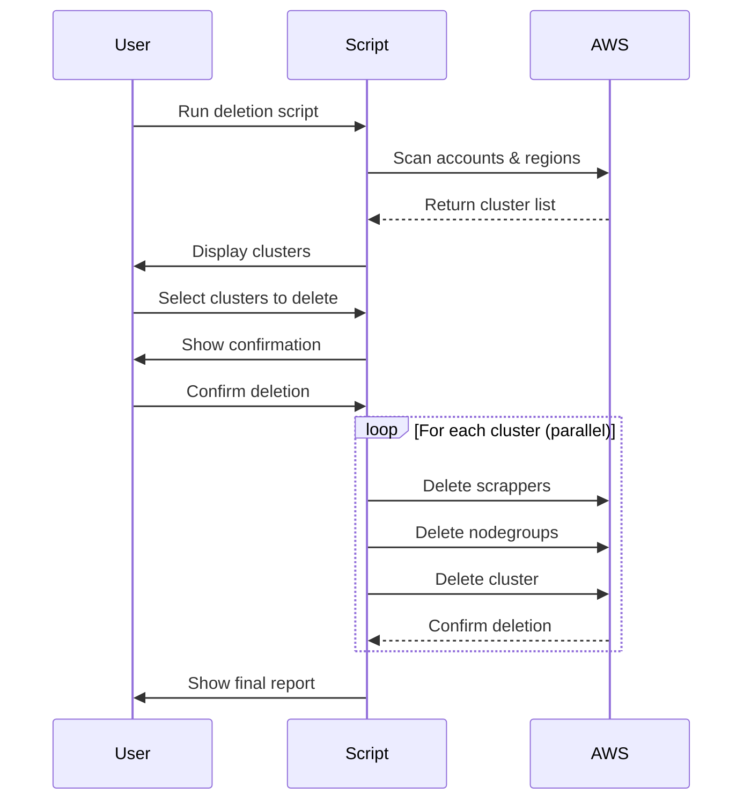
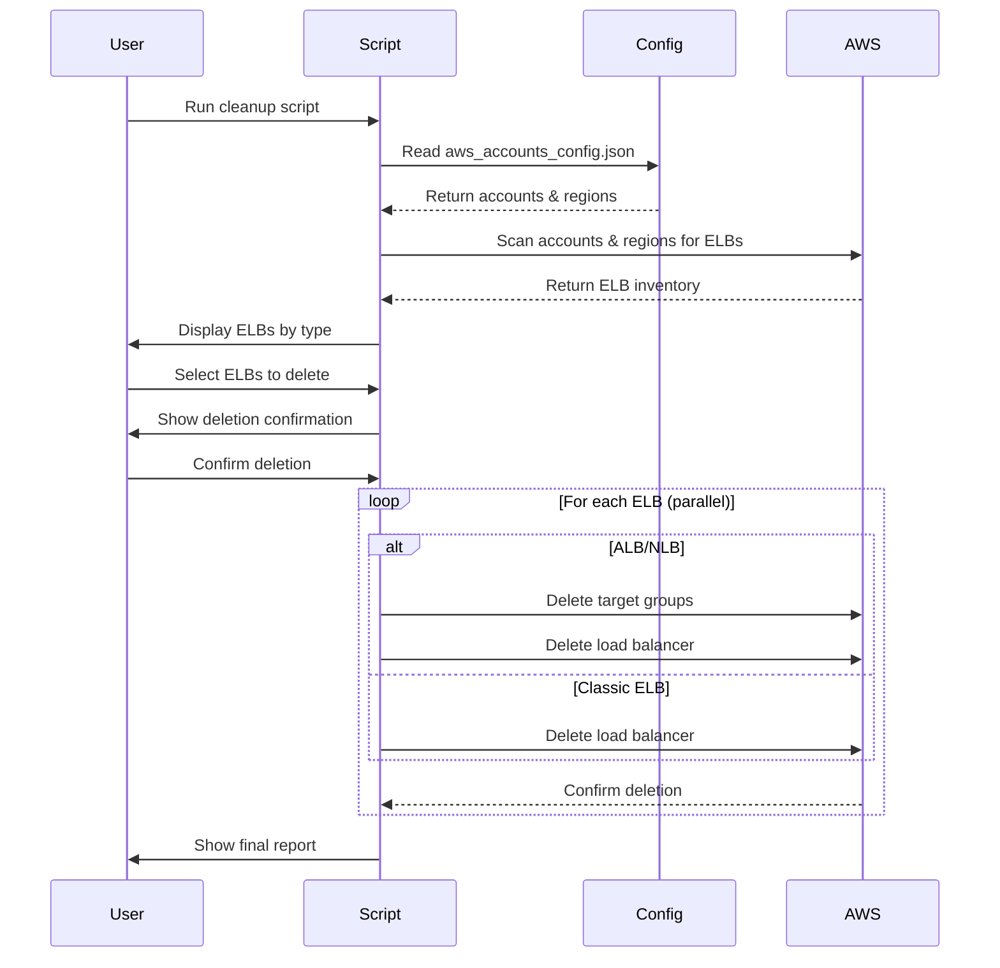

<div align="center">

# 🚀 AWS Infrastructure One-Click Automation Suite


<p align="center">
  
  
  
  
  
</p>

### 🎯 **Automate Your AWS Infrastructure with a Single Click!**

*Streamline the creation, management, and cleanup of IAM roles, EKS clusters, EC2 instances, and ELBs across multiple AWS accounts with our powerful automation suite.*

<p align="center">
  <a href="#-quick-start">Quick Start</a> •
  <a href="#-features">Features</a> •
  <a href="#-installation">Installation</a> •
  <a href="#-usage-guide">Usage Guide</a> •
  <a href="#-documentation">Documentation</a> •
  <a href="#-contributing">Contributing</a>
</p>

---

### 📈 **Project Statistics**

<table align="center">
<tr>
<td align="center"><strong>🏗️ Infrastructure Types</strong></td>
<td align="center"><strong>⚡ Automation Scripts</strong></td>
<td align="center"><strong>🌍 Multi-Region</strong></td>
<td align="center"><strong>🔧 Languages</strong></td>
</tr>
<tr>
<td align="center">IAM • EKS • EC2 • ELB</td>
<td align="center">15+ Scripts</td>
<td align="center">5 AWS Regions</td>
<td align="center">Python • Shell</td>
</tr>
</table>

</div>

---

## 📋 Table of Contents

- [✨ Features](#-features)
- [🎥 What This Project Does](#-what-this-project-does)
- [🏗️ Architecture Overview](#️-architecture-overview)
- [📦 Prerequisites](#-prerequisites)
- [🔧 Installation](#-installation)
- [🚀 Quick Start](#-quick-start)
- [📖 Detailed Usage Guide](#-detailed-usage-guide)
  - [🔐 IAM Management](#-iam-management)
  - [☸️ EKS Cluster Operations](#️-eks-cluster-operations)
  - [💻 EC2 Instance Management](#-ec2-instance-management)
  - [⚖️ ELB Cleanup Operations](#️-elb-cleanup-operations)
- [🔐 Security Best Practices](#-security-best-practices)
- [🛠️ Troubleshooting](#️-troubleshooting)
- [🤝 Contributing](#-contributing)
- [📄 License](#-license)
- [👨‍💻 Author](#-author)

---

## 🎥 What This Project Does

<div align="center">

### 🎯 **Complete AWS Infrastructure Automation**

This project provides a comprehensive suite of Python scripts that automate the entire lifecycle of AWS infrastructure components across **multiple AWS accounts** with **parallel processing** capabilities.

</div>

<table>
<tr>
<td width="25%" align="center">

### 🏗️ **CREATE**
- **EKS Clusters** with node groups
- **EC2 Instances** with auto-scaling
- **IAM Roles** with policies
- **Load Balancers** (ALB/NLB/Classic)

</td>
<td width="25%" align="center">

### 🔄 **MANAGE**
- **Multi-account** operations
- **Parallel processing** for speed
- **Real-time monitoring**
- **Detailed logging**

</td>
<td width="25%" align="center">

### 🗑️ **CLEANUP**
- **Safe deletion** with confirmations
- **Scrapper removal** before EKS deletion
- **Thread-safe** operations
- **Comprehensive reporting**

</td>
<td width="25%" align="center">

### 📊 **MONITOR**
- **Progress tracking**
- **Error handling**
- **Performance metrics**
- **Audit trails**

</td>
</tr>
</table>

---

## ✨ Features

<div align="center">

### 🌟 **Core Capabilities**

</div>

<table>
<tr>
<td width="33%" valign="top">

### 🔐 **IAM Management**
- ✅ **Automated Role Creation**
- ✅ **Policy Attachment & Management**
- ✅ **Service-Linked Roles**
- ✅ **Cross-Account Access Setup**
- ✅ **Security Best Practices**
- ✅ **Compliance Validation**

</td>
<td width="33%" valign="top">

### ☸️ **EKS Automation**
- ✅ **Production-Ready Clusters**
- ✅ **Multi-AZ Node Groups**
- ✅ **RBAC Configuration**
- ✅ **Add-ons Management**
- ✅ **Auto-scaling Setup**
- ✅ **Monitoring Integration**

</td>
<td width="33%" valign="top">

### 💻 **EC2 Operations**
- ✅ **Instance Launch & Config**
- ✅ **Security Group Setup**
- ✅ **Auto-scaling Groups**
- ✅ **Volume Management**
- ✅ **Tags & Metadata**
- ✅ **Systems Manager Integration**

</td>
</tr>
</table>

<table>
<tr>
<td width="33%" valign="top">

### ⚖️ **ELB Management**
- ✅ **Classic Load Balancers**
- ✅ **Application Load Balancers**
- ✅ **Network Load Balancers**
- ✅ **Target Group Management**
- ✅ **Health Checks**
- ✅ **SSL/TLS Configuration**

</td>
<td width="33%" valign="top">

### 🚀 **Advanced Features**
- ✅ **Multi-Account Support**
- ✅ **Parallel Processing**
- ✅ **Thread-Safe Operations**
- ✅ **Real-time Progress**
- ✅ **Comprehensive Logging**
- ✅ **Error Recovery**

</td>
<td width="33%" valign="top">

### 🛡️ **Safety & Security**
- ✅ **Multiple Confirmations**
- ✅ **Dry-Run Mode**
- ✅ **Audit Logging**
- ✅ **Rollback Capabilities**
- ✅ **Encryption Support**
- ✅ **Access Control**

</td>
</tr>
</table>

---

## 🏗️ Architecture Overview

<div align="center">

### 📐 **System Architecture Diagram**

```mermaid
graph TB
    subgraph "🎯 One-Click Automation Suite"
        A[Main Controller] --> B[🔐 IAM Module]
        A --> C[☸️ EKS Module]
        A --> D[💻 EC2 Module]
        A --> E[⚖️ ELB Module]
    end
    
    subgraph "🔐 IAM Operations"
        B --> B1[Create Roles]
        B --> B2[Attach Policies]
        B --> B3[Generate Keys]
        B --> B4[Security Validation]
    end
    
    subgraph "☸️ EKS Operations"
        C --> C1[Create Clusters]
        C --> C2[Configure Networking]
        C --> C3[Deploy Node Groups]
        C --> C4[Setup Monitoring]
        C --> C5[Delete Scrappers]
    end
    
    subgraph "💻 EC2 Operations"
        D --> D1[Launch Instances]
        D --> D2[Configure Security]
        D --> D3[Setup Auto-scaling]
        D --> D4[Volume Management]
    end
    
    subgraph "⚖️ ELB Operations"
        E --> E1[Scan Load Balancers]
        E --> E2[Delete ALB/NLB/Classic]
        E --> E3[Target Group Cleanup]
        E --> E4[Parallel Processing]
    end
    
    subgraph "🌍 Multi-Account Support"
        F[Account 1] --> G[Config Management]
        H[Account 2] --> G
        I[Account N] --> G
        G --> J[Region Selection]
        J --> K[Parallel Execution]
    end
    
    A --> F
    A --> H
    A --> I
    
    style A fill:#f9f,stroke:#333,stroke-width:4px
    style B fill:#bbf,stroke:#333,stroke-width:2px
    style C fill:#bfb,stroke:#333,stroke-width:2px
    style D fill:#fbb,stroke:#333,stroke-width:2px
    style E fill:#ffb,stroke:#333,stroke-width:2px
    style G fill:#fbf,stroke:#333,stroke-width:2px
```

</div>



---

## 📦 Prerequisites

<details>
<summary><b>🔍 Click to expand system requirements</b></summary>

### 💻 **System Requirements**
- **Operating System**: Windows 10+, macOS 10.15+, Ubuntu 18.04+
- **Python**: 3.8 or higher
- **Memory**: 4GB RAM minimum, 8GB recommended
- **Storage**: 2GB free space
- **Network**: Stable internet connection

### 🔧 **Required Software**
- **AWS CLI**: Version 2.x
- **kubectl**: Latest stable version
- **eksctl**: 0.150.0 or higher
- **Git**: For cloning the repository

### 📋 **AWS Requirements**
- **Active AWS Account(s)**: One or multiple accounts
- **IAM Permissions**: Administrative access or specific permissions
- **AWS Credentials**: Access keys configured
- **Regions**: Access to target AWS regions

### 🛠️ **Installation Commands**

```bash
# Install Python dependencies
pip install boto3 awscli pyyaml requests threading

# Install AWS CLI (Linux/macOS)
curl "https://awscli.amazonaws.com/awscli-exe-linux-x86_64.zip" -o "awscliv2.zip"
unzip awscliv2.zip
sudo ./aws/install

# Install AWS CLI (Windows)
# Download and run: https://awscli.amazonaws.com/AWSCLIV2.msi

# Install kubectl (Linux)
curl -LO "https://dl.k8s.io/release/$(curl -L -s https://dl.k8s.io/release/stable.txt)/bin/linux/amd64/kubectl"
sudo install -o root -g root -m 0755 kubectl /usr/local/bin/kubectl

# Install kubectl (macOS)
brew install kubectl

# Install kubectl (Windows)
# Download from: https://dl.k8s.io/release/v1.28.0/bin/windows/amd64/kubectl.exe

# Install eksctl (Linux/macOS)
curl --silent --location "https://github.com/weaveworks/eksctl/releases/latest/download/eksctl_$(uname -s)_amd64.tar.gz" | tar xz -C /tmp
sudo mv /tmp/eksctl /usr/local/bin

# Install eksctl (Windows)
# Download from: https://github.com/weaveworks/eksctl/releases
```

</details>

---

## 🔧 Installation

### 📥 **Step 1: Clone the Repository**

```bash
# Clone the repository
git clone https://github.com/varadharajaan/aws-create-iam-eks-ec2-one-click.git

# Navigate to the project directory
cd aws-create-iam-eks-ec2-one-click

# Check project structure
ls -la
```

### 📦 **Step 2: Install Dependencies**

```bash
# Install Python dependencies
pip install -r requirements.txt

# Or install manually
pip install boto3 awscli pyyaml requests colorama threading concurrent.futures
```

### ⚙️ **Step 3: Configure AWS Credentials**

```bash
# Configure AWS CLI (method 1)
aws configure

# Or set environment variables (method 2)
export AWS_ACCESS_KEY_ID="your-access-key"
export AWS_SECRET_ACCESS_KEY="your-secret-key"
export AWS_DEFAULT_REGION="us-east-1"
```

### 📝 **Step 4: Setup Configuration File**

Create your `aws_accounts_config.json` file:

```json
{
  "accounts": {
    "account01": {
      "account_id": "123456789012",
      "email": "user@example.com",
      "access_key": "YOUR_ACCESS_KEY",
      "secret_key": "YOUR_SECRET_KEY"
    },
    "account02": {
      "account_id": "123456789013",
      "email": "user2@example.com",
      "access_key": "YOUR_ACCESS_KEY_2",
      "secret_key": "YOUR_SECRET_KEY_2"
    }
  },
  "user_settings": {
    "password": "YourSecurePassword@123",
    "allowed_instance_types": ["t2.micro", "t3.micro", "c6a.large"],
    "users_per_account": 5,
    "user_regions": ["us-east-1", "us-east-2", "us-west-1", "us-west-2", "ap-south-1"]
  }
}
```

---

## 🚀 Quick Start

<div align="center">

### **🎯 Get Started in 3 Simple Steps!**

</div>

<table>
<tr>
<td width="33%" align="center">

### **1️⃣ Configure**
```bash
# Setup your config file
cp config.example.json aws_accounts_config.json
# Edit with your credentials
```

</td>
<td width="33%" align="center">

### **2️⃣ Choose Operation**
```bash
# Create everything
python main.py --all

# Or specific operations
python create_eks_cluster.py
```

</td>
<td width="33%" align="center">

### **3️⃣ Monitor & Enjoy**
```bash
# Watch the magic happen!
# Real-time progress tracking
# Detailed logging included
```

</td>
</tr>
</table>

### 🎬 **Common Use Cases**

```bash
# 🏗️ CREATE OPERATIONS
python create_iam_roles.py                    # Create IAM roles
python create_eks_cluster.py                  # Create EKS clusters
python create_ec2_instances.py                # Launch EC2 instances

# 🗑️ CLEANUP OPERATIONS  
python eks_delete_cleanup_threaded.py         # Delete EKS clusters (with scrappers)
python elb_cleanup_multi_account.py           # Clean up all ELBs

# 🔧 UTILITY OPERATIONS
python utils/validate.py                      # Validate configurations
python utils/monitor.py                       # Monitor resources
python utils/cleanup.py --dry-run             # Preview cleanup operations
```

---

## 📖 Detailed Usage Guide

### 🔐 IAM Management

<details>
<summary><b>📁 create_iam_roles.py</b> - Comprehensive IAM Role Automation</summary>

#### 🎯 **Purpose**
Automates the creation and configuration of IAM roles required for EKS clusters, EC2 instances, and cross-account access with security best practices.

#### ✨ **Features**
- ✅ **EKS Service Roles** - Complete cluster role setup
- ✅ **Node Instance Profiles** - Worker node permissions
- ✅ **Trust Relationships** - Secure service-to-service access
- ✅ **Policy Management** - Automatic policy attachment
- ✅ **Security Validation** - Compliance checking
- ✅ **Cross-Account Support** - Multi-account role creation

#### 🚀 **Usage Examples**

```bash
# Basic IAM role creation
python create_iam_roles.py

# With custom configuration
python create_iam_roles.py --config config/iam_config.yaml

# Dry run mode (preview changes without executing)
python create_iam_roles.py --dry-run

# Verbose logging
python create_iam_roles.py --verbose

# Create roles for specific accounts
python create_iam_roles.py --accounts account01,account02
```

#### 📋 **Configuration Example**

```yaml
# config/iam_config.yaml
roles:
  eks_cluster_role:
    name: "EKSClusterServiceRole"
    description: "Role for EKS cluster operations"
    trust_policy: "eks.amazonaws.com"
    policies:
      - "arn:aws:iam::aws:policy/AmazonEKSClusterPolicy"
      - "arn:aws:iam::aws:policy/AmazonEKSVPCResourceController"
    tags:
      Environment: "Production"
      ManagedBy: "AutomationSuite"
  
  node_instance_role:
    name: "EKSNodeInstanceRole"
    description: "Role for EKS worker nodes"
    trust_policy: "ec2.amazonaws.com"
    policies:
      - "arn:aws:iam::aws:policy/AmazonEKSWorkerNodePolicy"
      - "arn:aws:iam::aws:policy/AmazonEKS_CNI_Policy"
      - "arn:aws:iam::aws:policy/AmazonEC2ContainerRegistryReadOnly"
    instance_profile: true
    tags:
      Environment: "Production"
      NodeType: "Worker"

security_settings:
  enforce_mfa: true
  session_duration: 3600
  external_id_required: false
```

#### 📊 **Output & Reporting**
- **Real-time Progress**: Live updates during role creation
- **Detailed Logs**: Complete audit trail in `iam_creation_log_YYYYMMDD_HHMMSS.log`
- **Summary Report**: Final report with created roles and any errors
- **JSON Export**: Machine-readable output for automation pipelines

</details>

### ☸️ EKS Cluster Operations

<details>
<summary><b>📁 create_eks_cluster.py</b> - Production-Ready Kubernetes Automation</summary>

#### 🎯 **Purpose**
Provisions production-ready EKS clusters with best practices for security, scalability, and high availability across multiple AWS regions.

#### ✨ **Features**
- ✅ **Multi-AZ Deployment** - High availability setup
- ✅ **Private Endpoint Access** - Enhanced security
- ✅ **Managed Node Groups** - Automatic scaling and updates
- ✅ **Add-ons Management** - CNI, CoreDNS, kube-proxy
- ✅ **RBAC Configuration** - Role-based access control
- ✅ **Monitoring Integration** - CloudWatch and Prometheus ready

#### 🚀 **Usage Examples**

```bash
# Create basic EKS cluster
python create_eks_cluster.py \
  --cluster-name my-production-cluster \
  --region us-east-1

# Advanced configuration with multiple node groups
python create_eks_cluster.py \
  --cluster-name production-cluster \
  --region us-west-2 \
  --node-count 3 \
  --node-type t3.medium \
  --kubernetes-version 1.28

# Create cluster with spot instances
python create_eks_cluster.py \
  --cluster-name cost-optimized-cluster \
  --region us-east-1 \
  --spot-instances \
  --min-nodes 2 \
  --max-nodes 10

# Use configuration file for complex setups
python create_eks_cluster.py --config config/eks_production.yaml

# Create across multiple accounts
python create_eks_cluster.py \
  --config config/multi_account_eks.yaml \
  --accounts account01,account02,account03
```

#### 🔄 **Post-Deployment Operations**

```bash
# Update kubeconfig
aws eks update-kubeconfig --region us-west-2 --name production-k8s-cluster

# Verify cluster access
kubectl get nodes
kubectl get pods --all-namespaces

# Deploy sample application
kubectl apply -f examples/sample-app.yaml

# Install additional tools
kubectl apply -f https://raw.githubusercontent.com/kubernetes/dashboard/v2.7.0/aio/deploy/recommended.yaml

# Setup monitoring
helm repo add prometheus-community https://prometheus-community.github.io/helm-charts
helm install prometheus prometheus-community/kube-prometheus-stack
```

</details>

<details>
<summary><b>📁 eks_delete_cleanup_threaded.py</b> - Safe EKS Cluster Deletion with Scrapper Cleanup</summary>

#### 🎯 **Purpose**
Safely deletes EKS clusters with comprehensive cleanup of associated resources including scrappers, monitoring tools, and dependencies using parallel processing.

#### ✨ **Features**
- ✅ **Scrapper Cleanup** - Removes monitoring tools before cluster deletion
- ✅ **Parallel Processing** - Up to 3 simultaneous cluster deletions
- ✅ **Safety Confirmations** - Multiple confirmation steps
- ✅ **Thread-Safe Operations** - Concurrent execution without conflicts
- ✅ **Comprehensive Logging** - Detailed audit trails
- ✅ **Error Recovery** - Handles partial failures gracefully

#### 🔧 **Scrapper Types Detected & Removed**
- **CloudWatch Alarms** - Custom metrics and alarms
- **AMP Workspaces** - Amazon Managed Prometheus
- **EKS Add-ons** - Monitoring add-ons (fluent-bit, ADOT, CloudWatch)
- **EC2 Instances** - Tagged scrapper instances
- **Kubernetes Deployments** - Prometheus, Grafana, Jaeger, etc.

#### 🚀 **Usage Examples**

```bash
# Interactive cluster deletion with scrapper cleanup
python eks_delete_cleanup_threaded.py

# The script will:
# 1. Scan all accounts and regions
# 2. Display found clusters
# 3. Allow selection of clusters to delete
# 4. Show confirmation with details
# 5. Delete scrappers first, then nodegroups, then clusters
```

#### 📊 **Deletion Process Flow**



</details>

### 💻 EC2 Instance Management

<details>
<summary><b>📁 create_ec2_instances.py</b> - Comprehensive EC2 Automation</summary>

#### 🎯 **Purpose**
Automates EC2 instance provisioning with security best practices, monitoring setup, and comprehensive configuration management.

#### ✨ **Features**
- ✅ **Auto-generated Security Groups** - Best practice firewall rules
- ✅ **CloudWatch Monitoring** - Detailed metrics and alarms
- ✅ **Systems Manager Integration** - Remote management capabilities
- ✅ **EBS Encryption** - Data protection at rest
- ✅ **Auto-scaling Groups** - Dynamic capacity management
- ✅ **Multi-AZ Deployment** - High availability setup

#### 🚀 **Usage Examples**

```bash
# Launch a single instance
python create_ec2_instances.py \
  --instance-type t3.micro \
  --ami-id ami-0c55b159cbfafe1f0 \
  --key-name my-key-pair \
  --subnet-id subnet-12345678

# Launch multiple instances with auto-scaling
python create_ec2_instances.py \
  --auto-scaling \
  --min-size 2 \
  --max-size 10 \
  --desired-capacity 4 \
  --instance-type t3.medium

# Use comprehensive configuration file
python create_ec2_instances.py --config config/ec2_production.yaml

# Launch instances across multiple accounts
python create_ec2_instances.py \
  --config config/multi_account_ec2.yaml \
  --accounts account01,account02
```

</details>

### ⚖️ ELB Cleanup Operations

<details>
<summary><b>📁 elb_cleanup_multi_account.py</b> - Comprehensive Load Balancer Cleanup</summary>

#### 🎯 **Purpose**
Performs comprehensive cleanup of all types of Elastic Load Balancers (Classic, ALB, NLB) across multiple AWS accounts and regions with parallel processing.

#### ✨ **Features**
- ✅ **All ELB Types** - Classic, Application, and Network Load Balancers
- ✅ **Target Group Cleanup** - Removes associated target groups
- ✅ **Parallel Processing** - Up to 5 simultaneous deletions
- ✅ **Multi-Account Support** - Operates across multiple AWS accounts
- ✅ **Region-Aware** - Uses regions from configuration file
- ✅ **Safety Confirmations** - Multiple confirmation steps

#### 🔧 **ELB Types Supported**
- **Classic Load Balancers (ELB)** - Legacy load balancers
- **Application Load Balancers (ALB)** - Layer 7 load balancing
- **Network Load Balancers (NLB)** - Layer 4 load balancing
- **Target Groups** - Associated target group cleanup

#### 🚀 **Usage Examples**

```bash
# Interactive ELB cleanup across all accounts
python elb_cleanup_multi_account.py

# The script will:
# 1. Read regions from aws_accounts_config.json
# 2. Scan all accounts across all configured regions
# 3. Display found ELBs with details
# 4. Allow selection of ELBs to delete
# 5. Show confirmation with ELB details
# 6. Delete target groups first, then load balancers
```

#### 📊 **Cleanup Process Flow**



#### 📊 **Generated Reports**

The script generates detailed reports including:
- **Execution Summary** - Overall statistics and timing
- **Successful Deletions** - Complete list with timing details
- **Failed Deletions** - Errors and troubleshooting information
- **Thread Utilization** - Parallel processing efficiency
- **Performance Metrics** - Speed and resource usage

</details>

---

## 🔐 Security Best Practices

<div align="center">

### 🛡️ **Comprehensive Security Framework**

</div>

<table>
<tr>
<td width="25%" align="center">

### 🔑 **Access Control**
- **IAM Least Privilege**
- **MFA Enforcement**
- **Role-Based Access**
- **Service Accounts**

</td>
<td width="25%" align="center">

### 🔒 **Data Protection**
- **Encryption at Rest**
- **Encryption in Transit**
- **Key Management**
- **Secrets Management**

</td>
<td width="25%" align="center">

### 🌐 **Network Security**
- **VPC Isolation**
- **Security Groups**
- **NACLs**
- **Private Subnets**

</td>
<td width="25%" align="center">

### 📊 **Monitoring**
- **CloudTrail Logging**
- **VPC Flow Logs**
- **Real-time Alerts**
- **Compliance Reports**

</td>
</tr>
</table>

### 🛡️ **Security Checklist**

- ✅ **Credentials Management**
  - [ ] AWS credentials stored securely (not in code)
  - [ ] IAM roles used instead of long-term access keys
  - [ ] MFA enabled for privileged accounts
  - [ ] Regular credential rotation implemented

- ✅ **Network Security**
  - [ ] Resources deployed in private subnets when possible
  - [ ] Security groups follow least privilege principle
  - [ ] VPC Flow Logs enabled
  - [ ] WAF deployed for public-facing applications

- ✅ **Data Protection**
  - [ ] EBS volumes encrypted at rest
  - [ ] S3 buckets have encryption enabled
  - [ ] Database encryption enabled
  - [ ] TLS/SSL used for data in transit

- ✅ **Monitoring & Compliance**
  - [ ] CloudTrail enabled across all regions
  - [ ] AWS Config rules configured
  - [ ] CloudWatch alarms set for security events
  - [ ] Regular security assessments performed

---

## 🛠️ Troubleshooting

<details>
<summary><b>🔴 Common Issues and Solutions</b></summary>

### 🔧 **IAM Permission Errors**

**Error**: `User is not authorized to perform: iam:CreateRole`

**Solution**:
```bash
# Ensure your AWS user has the required IAM permissions
aws iam attach-user-policy \
  --user-name YOUR_USER \
  --policy-arn arn:aws:iam::aws:policy/IAMFullAccess

# Or create a custom policy with minimal required permissions
aws iam create-policy \
  --policy-name EKS-Automation-Policy \
  --policy-document file://policies/eks-automation-policy.json
```

### 🔧 **EKS Cluster Creation Failures**

**Error**: `Cannot create cluster, VPC not found`

**Solution**:
```bash
# Option 1: Let the script create a VPC
python create_eks_cluster.py --create-vpc

# Option 2: Specify existing VPC in configuration
# Edit your config file to include:
# vpc_id: "vpc-0123456789abcdef0"
# subnet_ids: ["subnet-xxx", "subnet-yyy"]

# Option 3: Create VPC manually
aws ec2 create-vpc --cidr-block 10.0.0.0/16
```

### 🔧 **Configuration File Issues**

**Error**: `Configuration file not found`

**Solution**:
```bash
# Create configuration file from template
cp aws_accounts_config.example.json aws_accounts_config.json

# Validate JSON format
python -m json.tool aws_accounts_config.json

# Check file permissions
ls -la aws_accounts_config.json
chmod 600 aws_accounts_config.json  # Secure the file
```

### 🔧 **Python Environment Issues**

**Error**: `ModuleNotFoundError: No module named 'boto3'`

**Solution**:
```bash
# Check Python version
python --version
python3 --version

# Install required packages
pip install -r requirements.txt

# Or install individually
pip install boto3 awscli pyyaml requests colorama

# Use virtual environment (recommended)
python -m venv aws-automation-env
source aws-automation-env/bin/activate  # Linux/macOS
# aws-automation-env\Scripts\activate   # Windows
pip install -r requirements.txt
```

</details>

---

## 🤝 Contributing

<div align="center">

### 🌟 **We Welcome Contributions!**

*Help us make this project even better by contributing code, documentation, or feedback.*

</div>

### 📝 **How to Contribute**

<table>
<tr>
<td width="25%" align="center">

### **1️⃣ Fork & Clone**
```bash
# Fork the repository
# Clone your fork
git clone https://github.com/YOUR_USERNAME/aws-create-iam-eks-ec2-one-click.git
```

</td>
<td width="25%" align="center">

### **2️⃣ Create Branch**
```bash
# Create feature branch
git checkout -b feature/amazing-feature

# Or bug fix branch
git checkout -b bugfix/fix-issue-123
```

</td>
<td width="25%" align="center">

### **3️⃣ Make Changes**
```bash
# Make your changes
# Test thoroughly
# Add documentation
# Update CHANGELOG.md
```

</td>
<td width="25%" align="center">

### **4️⃣ Submit PR**
```bash
# Commit changes
git commit -m 'Add amazing feature'

# Push to branch
git push origin feature/amazing-feature

# Open Pull Request
```

</td>
</tr>
</table>

### 🎯 **Contribution Guidelines**

<details>
<summary><b>📋 Development Standards</b></summary>

#### **Code Quality**
- ✅ Follow PEP 8 style guidelines
- ✅ Include comprehensive docstrings
- ✅ Add type hints where appropriate
- ✅ Write unit tests for new features
- ✅ Ensure backward compatibility

#### **Documentation**
- ✅ Update README.md for new features
- ✅ Add inline comments for complex logic
- ✅ Update configuration examples
- ✅ Include usage examples

#### **Testing**
- ✅ Test across multiple Python versions (3.8+)
- ✅ Test with different AWS regions
- ✅ Include both positive and negative test cases
- ✅ Test error handling and edge cases

#### **Security**
- ✅ Never commit sensitive data (keys, passwords)
- ✅ Use IAM roles instead of long-term credentials
- ✅ Follow AWS security best practices
- ✅ Validate all user inputs

</details>

### 🏆 **Types of Contributions**

- 🐛 **Bug Reports** - Help us identify and fix issues
- 💡 **Feature Requests** - Suggest new functionality
- 📝 **Documentation** - Improve guides and examples
- 🧪 **Testing** - Add test cases and improve coverage
- 🔧 **Code** - Implement new features or fix bugs
- 🎨 **UI/UX** - Improve user experience and interfaces

### 📞 **Getting Help**

- 💬 **Discussions** - Join our community discussions for questions and ideas
- 📧 **Email Support** - Contact us at [varathu09@gmail.com](mailto:varathu09@gmail.com)
- 🐛 **Issues** - Report bugs or request features via GitHub Issues
- 📖 **Documentation** - Check our comprehensive guides and examples
- 🤝 **Community** - Connect with other users and contributors
- 💡 **Stack Overflow** - Tag your questions with `aws-automation-suite`

---

## 📄 License

<div align="center">

### 📜 **MIT License**

*This project is licensed under the MIT License - see the [LICENSE](LICENSE) file for details.*

**You are free to:**
- ✅ Use commercially
- ✅ Modify and distribute
- ✅ Use privately
- ✅ Sublicense

**Conditions:**
- 📋 Include license and copyright notice
- 📋 No warranty provided

</div>

---

## 👨‍💻 Author

<div align="center">

### **🚀 Varadharajaan**


**📧 Email**: [varathu09@gmail.com](mailto:varathu09@gmail.com)  
**🐙 GitHub**: [@varadharajaan](https://github.com/varadharajaan)  
**💼 LinkedIn**: [Connect with me](https://linkedin.com/in/varadharajaan)  
**🌐 Website**: [Portfolio](https://varadharajaan.dev)  

---

### **💭 About the Creator**

*Passionate Cloud Infrastructure Engineer with expertise in AWS, Kubernetes, and automation. Dedicated to building tools that simplify complex infrastructure operations while maintaining security and reliability standards.*

**🎯 Specializations:**
- ☁️ **AWS Architecture** - Designing scalable cloud solutions
- ⚙️ **Infrastructure as Code** - Terraform, CloudFormation, CDK
- 🐳 **Container Orchestration** - Kubernetes, EKS, Docker
- 🔄 **CI/CD Pipelines** - Jenkins, GitHub Actions, GitLab CI
- 🛡️ **Security & Compliance** - IAM, Security Groups, Compliance frameworks
- 📊 **Monitoring & Observability** - CloudWatch, Prometheus, Grafana

**🏆 Achievements:**
- 🎖️ AWS Solutions Architect Professional
- 🎖️ Certified Kubernetes Administrator (CKA)
- 🎖️ AWS DevOps Engineer Professional
- 📈 10+ years in cloud infrastructure
- 🚀 50+ successful cloud migrations
- 👥 Led teams of 15+ engineers

---

### **🙏 Acknowledgments**

*Special thanks to the amazing open-source community and all contributors who make projects like this possible!*

**🌟 Contributors & Supporters:**
- AWS Community Builders Program
- Kubernetes SIG-AWS
- Open Source Community
- Beta testers and early adopters

</div>

---

<div align="center">

### **⭐ If this project helped you, please consider giving it a star!**


**🔔 Stay Updated** - Watch this repository for the latest features and updates!

---

**📅 Last Updated**: 2025-06-05 15:48:02 UTC  
**👤 Updated By**: varadharajaan  
**🏷️ Version**: 2.1.0  
**📊 Project Status**: Active Development

</div>